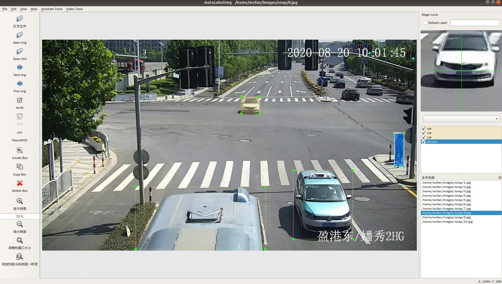

# AutoLabelImg：MultiFunction AutoAnnotate Tools



### [<u>English</u>](./readme.md)    |    [<u>中文</u>](./readme_CN.md)

### Introduction：

Based on [labelImg](https://github.com/tzutalin/labelImg), we add many useful annotate tools, in **Annoatate-tools** and **Video-tools** menu, including：

- **`TOOL LIST`**：
- [x] **Auto Annotate**：anto annotate images using yolov5 detector
- [x] **Tracking Annotate**：using tracking method in opencv, annotate video data
- [x] **Magnifing Lens**：helpful when annotating small objects, optional function
- [x] **Data Agument**：data agument
- [x] **Search System**：search details info based on your input
- [x] other tools：label selecting/rename/counting, fix annotation, video merge/extract, welcome to try

### Demo:

seen in Vtuber:

[Auto Annotate](https://www.bilibili.com/video/BV1Uu411Q7WW/)

[Tracking Annotate](https://www.bilibili.com/video/BV1XT4y1X7At/)

[Magnifing Lens](https://www.bilibili.com/video/BV1nL4y1G7qm/)

[Data Augment](https://www.bilibili.com/video/BV1Vu411R7Km/)

[Search System](https://www.bilibili.com/video/BV1ZL4y137ar/)

### Update log：

2022.01.14：remove Retinanet( matain yolov5 only), and add label selecting when autolabeling

2022.01.11：imporve magnifing lens, more fluent and can be shut

2020.12.28：add video tracking annotate

2020.12.10：autolabelimg，version 1.0

## Installation：

1. clone this repo：

   ```bash
   git clone https://github.com/wufan-tb/AutoLabelImg
   cd AutoLabelImg
   ```

2. install requirments：

   ```bash
   conda create -n {your_env_name} python=3.7.6
   conda activate {your_env_name}
   pip install -r requirements.txt
   ```

3. compile source code：

   **Ubuntu User:**
   
   ```
   sudo apt-get install pyqt5-dev-tools
   make qt5py3
   ```
   
   **Windows User:**
   
   ```
   pyrcc5 -o libs/resources.py resources.qrc
   ```
   
4. prepare yolov5 weights file and move them to here: [official model zoo:[Yolov5](https://github.com/ultralytics/yolov5)]

   ```bash
   mv {your_model_weight.pt} pytorch_yolov5/weights/
   ```

5. open labelimg software

   ```
   python labelImg.py
   ```

## Set shortcut to open software[optional]

**Windows User:**

create a file:labelImg.bat, open it and type these text(D disk as an example)：

```bash
D:
cd D:{path to your labelImg folder}
start python labelImg.py
exit
```

double click labelImg.bat to open the software.

**Ubuntu User:**

open environment setting file: 

```bash
vim ~/.bashrc
```

add this command：

```bash
alias labelimg='cd {path to your labelImg folder} && python labelImg.py
```

source it：

```bash
source ~/.bashrc
```

typing 'labeling' in terminal to open the software.

## Citation

```
{   AutoLabelImg,
    author = {Wu Fan},
    year = {2020},
    url = {\url{https://https://github.com/wufan-tb/AutoLabelImg}}
}
```

---

**ISSUE**

```shell
QObject::moveToThread: Current thread (0x562abab7a200) is not the object's thread (0x562abd2a0a70).
Cannot move to target thread (0x562abab7a200)

qt.qpa.plugin: Could not load the Qt platform plugin "xcb" in "/home/lcg/anaconda3/envs/autolabel/lib/python3.7/site-packages/cv2/qt/plugins" even though it was found.
This application failed to start because no Qt platform plugin could be initialized. Reinstalling the application may fix this problem.

Available platform plugins are: xcb, eglfs, linuxfb, minimal, minimalegl, offscreen, vnc, wayland-egl, wayland, wayland-xcomposite-egl, wayland-xcomposite-glx, webgl.

Aborted (core dumped)

==================================================================================
# reinstall opencv-python to lower cersion
pip uninstall opencv-python
pip install opencv-python==4.1.2.30

```

